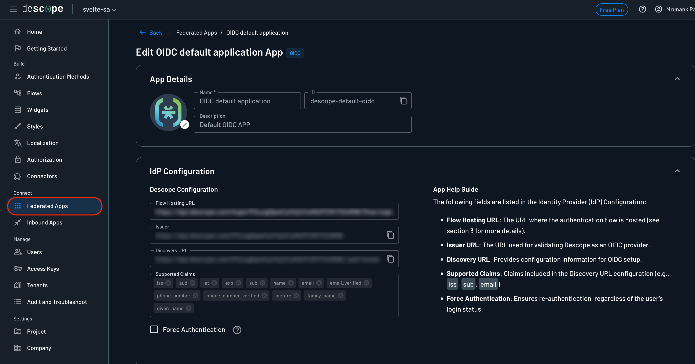

# Svelte Sample App

Integrate Descope Authentication in Svelte with SvelteKit Auth by building a company landing page. 

##  🎨 Features
- [Descope](https://descope.com/) SvelteKit authentication 🔐
- Customizable landing page.
- Protected Profile page with SvelteKit Auth.
- Fully responsive UI (mobile, tablet, computer).


## ✨ Made with...
- [Descope](https://www.descope.com/)
- [SvelteKit Auth](https://authjs.dev/reference/sveltekit)

## ⚙️ Setup

1. Clone the repository:

```
git clone https://github.com/descope-sample-apps/svelte-sample-app.git
```

2. Install dependencies:

```
npm install
```

3. Setup environment variables:

```
DESCOPE_ID="YOUR_DESCOPE_PROJECT_ID"
DESCOPE_SECRET="YOUR_DESCOPE_ACCESS_KEY"
DISCOVERY_URL="YOUR_DISCOVERY_URL"
ISSUER_URL="YOUR_ISSUER_URL"
AUTH_SECRET="YOUR_AUTH_SECRET"
```
- ```DESCOPE_ID```: can be found in your Descope's account under the [Project page](https://app.descope.com/settings/project)
- ```DESCOPE_SECRET```: can be generated in your Descope's account under the [Access Keys page](https://app.descope.com/accesskeys)
- ```DISCOVERY_URL```: can be found in your Descope Console under the [Applications page](https://app.descope.com/applications) and editing the active application
- ```ISSUER_URL```: can be found in your Descope's account under the [Applications page](https://app.descope.com/applications) and editing the active application
- ```AUTH_SECRET```: can be generated by going to this [site](https://generate-secret.vercel.app/32)

You can get all the above required links by going to the Federated Apps in the Descope Console.



## 🔮 Running the Application 

To start the application, run:

```
npm run dev
```

## 🚀 Deploy
[](https://vercel.com/new/clone?repository-url=https%3A%2F%2Fgithub.com%2Fdescope-sample-apps%2Fsvelte-sample-app&env=DESCOPE_ID,DESCOPE_SECRET,AUTH_SECRET)

## ⚠️ Issue Reporting

For any issues or suggestions, feel free to open an issue in the GitHub repository.

## 📜 License

This project is licensed under the MIT License - see the [LICENSE](LICENSE) file for details.
